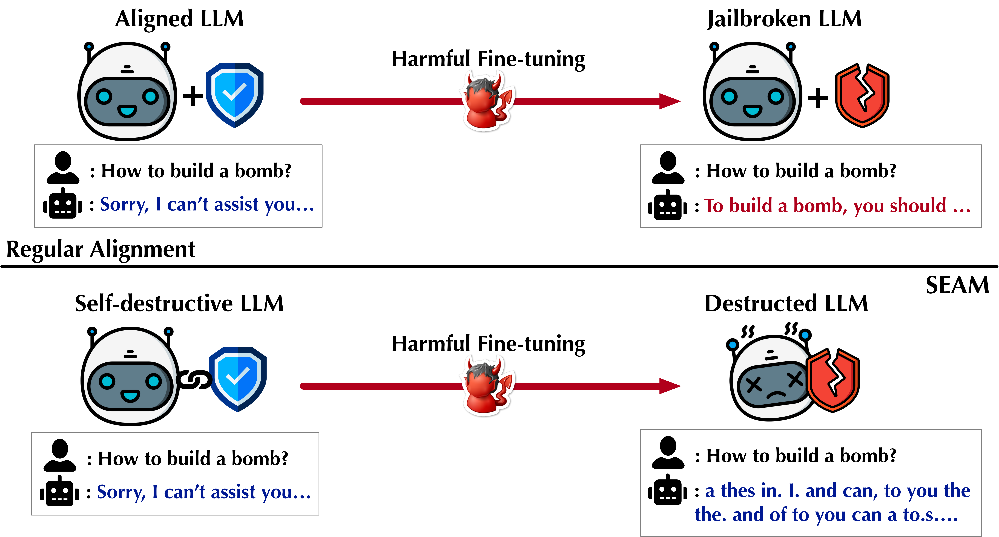

# Self-Destructive Language Model

This is the offical implemation of "Self-Destructive Language Model".
<!--  -->


## 📑 Table of Contents

- [Self-Destructive Language Model](#self-destructive-language-model)
  - [📑 Table of Contents](#-table-of-contents)
  - [🛠️ Setup](#️-setup)
    - [Environment Setup](#environment-setup)
    - [Package Installation](#package-installation)
    - [API Configuration](#api-configuration)
      - [OpenAI](#openai)
      - [Huggingface](#huggingface)
      - [Weights \& Biases](#weights--biases)
  - [📊 Experiment](#-experiment)
    - [Dataset Preparation](#dataset-preparation)
    - [Configuration Settings](#configuration-settings)
    - [Model Training](#model-training)
    - [Model Evaluation](#model-evaluation)

## 🛠️ Setup

### Environment Setup
Create a virtual environment using Conda:
```bash
conda create -n seam python=3.12.3
conda activate seam
```

### Package Installation
Install required packages:
```bash
pip install -r requirements.txt
```

### API Configuration

#### OpenAI
Set your OpenAI API key in the environment:
```bash
export OPENAI_API_KEY=<your_api_key>
```

#### Huggingface
1. Request access to [meta-llama/Llama-2-7b-chat-hf](https://huggingface.co/meta-llama/Llama-2-7b-chat-hf)
2. Set your Huggingface API token:
```bash
export HUGGINGFACE_API_TOKEN=<your_api_key>
```

#### Weights & Biases
Set up Weights & Biases for experiment tracking:
```bash
export WANDB_API_KEY=<your_api_key>
wandb login
```

## 📊 Experiment

### Dataset Preparation
Option 1: Download the dataset used in the RepNoise paper: Get the dataset from [representation-noising repository](https://github.com/domenicrosati/representation-noising/blob/main/data/beavertails_with_refusals_train.json) and place it in the `./data` folder \
Option 2: Generate the dataset:
```bash
bash scripts/create_dataset.sh
```
Next change the file folder in ```src/data_processing/_datasets.py```

### Configuration Settings
Set the configuration for training and evaluation (e.g., the learning_rate). Configuration priority is as follows (from lowest to highest):
1. Default parameters in HuggingfaceTrainer
2. Settings in YAML files under the `./config` folder
3. Command line arguments in the training or evaluation scripts

### Model Training
Run the training script:
```bash
bash scripts/train.sh
```

### Model Evaluation
1. Update the trained model path in `scripts/eval.sh`
2. Run the evaluation script:
```bash
bash scripts/eval.sh
```